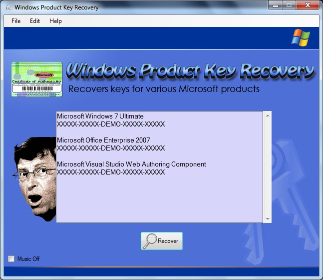

# Windows Product Key Recovery

This application can recovery keys from Windows, Office, and a few other products made by Microsoft that store their keys in the same way. Please only use the tool where you are allowed to. I originally created this tool so that I didn't have to trust the ones I found on the Internet. The design is starting to see its age since it was modeled around XP's registration window. This is my latest version of the tool, which now automatically detects new product editions without having to hardcode the support manually. There is still some work to be done before it becomes an official 2.0, so for now, consider it a working beta.

Releases: [https://github.com/StevenJDH/Windows-Product-Key-Recovery/releases](https://github.com/StevenJDH/Windows-Product-Key-Recovery/releases)

Changelog: [https://github.com/StevenJDH/Windows-Product-Key-Recovery/wiki/Changelog](https://github.com/StevenJDH/Windows-Product-Key-Recovery/wiki/Changelog)

## Features
* Key recovery for Windows, Office, and supported products.
* Smart detection to support old and new versions of products.
* Background Mod music where supported.

## Compatibility
This application should work on any mix configuration using 32-bit and 64-bit installations.

## TODO
* Clean up code for final 2.0 version.
* Fix mod music not playing on systems newer than XP.

## Do you have any questions?
Many commonly asked questions are answered in the FAQ:
[https://github.com/StevenJDH/Windows-Product-Key-Recovery/wiki/FAQ](https://github.com/StevenJDH/Windows-Product-Key-Recovery/wiki/FAQ)

## Want to show your support?

|Method       | Address                                                                                                    |
|------------:|:-----------------------------------------------------------------------------------------------------------|
|PayPal:      | [https://www.paypal.me/stevenjdh](https://www.paypal.me/stevenjdh "Steven's Paypal Page")                  |
|Bitcoin:     | 3GyeQvN6imXEHVcdwrZwKHLZNGdnXeDfw2                                                                         |
|Litecoin:    | MAJtR4ccdyUQtiiBpg9PwF2AZ6Xbk5ioLm                                                                         |
|Ethereum:    | 0xa62b53c1d49f9C481e20E5675fbffDab2Fcda82E                                                                 |
|Dash:        | Xw5bDL93fFNHe9FAGHV4hjoGfDpfwsqAAj                                                                         |
|Zcash:       | t1a2Kr3jFv8WksgPBcMZFwiYM8Hn5QCMAs5                                                                        |
|PIVX:        | DQq2qeny1TveZDcZFWwQVGdKchFGtzeieU                                                                         |
|Ripple:      | rLHzPsX6oXkzU2qL12kHCH8G8cnZv1rBJh Destination Tag: 2357564055                                        |
|Monero:      | 4GdoN7NCTi8a5gZug7PrwZNKjvHFmKeV11L6pNJPgj5QNEHsN6eeX3D &#8618;aAQFwZ1ufD4LYCZKArktt113W7QjWvQ7CWDXrwM8yCGgEdhV3Wt|

// Steven Jenkins De Haro ("StevenJDH" on GitHub)
